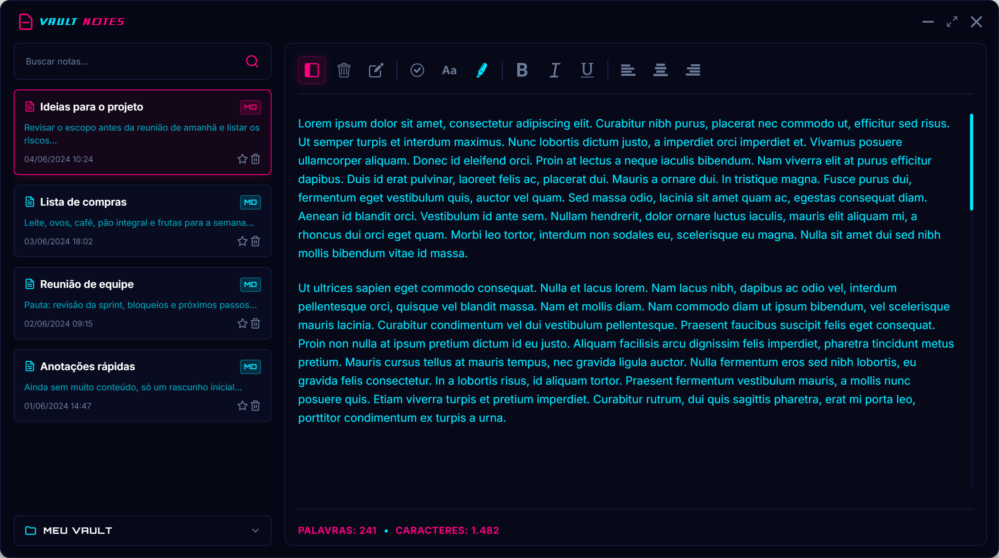

# Vault Notes

Um app de notas para desktop, rápido e com boa experiência de teclado, com visual escuro e detalhes neon. As notas ficam salvas como arquivos Markdown (ou `.txt`) numa pasta do seu disco — o seu próprio "vault" — então elas continuam portáveis e legíveis fora do app também.

<div align="center">

  

  <a href="./LICENSE" target="_blank">
      
  </a>
  
  
  
  
  
</div>

## Funcionalidades

- **Vaults** — escolha qualquer pasta do disco como vault e alterne entre vários vaults; as notas são salvas como arquivos `.md`/`.txt` de verdade, não presas num banco de dados.
- **Edição de texto rica** — negrito, itálico, sublinhado, família e tamanho de fonte, cor de texto personalizada, alinhamento de texto e checklists, com tudo baseado em Markdown para o formato ir e voltar do disco sem perdas.
- **Sidebar** — busca de notas, favoritos, renomear direto na lista, excluir para a lixeira e redimensionar a largura da sidebar como preferir.
- **Estatísticas ao vivo** — contagem de palavras e caracteres atualizada enquanto você digita.
- **Layout responsivo** — a janela redimensiona até 400px de largura, escondendo a sidebar automaticamente quando não há espaço para ela e o editor juntos.
- **Tema escuro neon** — identidade visual própria em ciano/magenta em todo o app.

## Desenvolvimento

### IDE recomendada

- [VSCode](https://code.visualstudio.com/) + [ESLint](https://marketplace.visualstudio.com/items?itemName=dbaeumer.vscode-eslint) + [Prettier](https://marketplace.visualstudio.com/items?itemName=esbenp.prettier-vscode)

### Instalar

```bash
npm install
```

### Rodar em modo dev

```bash
npm run dev
```

### Build

```bash
# Para Windows
npm run build:win

# Para macOS
npm run build:mac

# Para Linux
npm run build:linux
```
