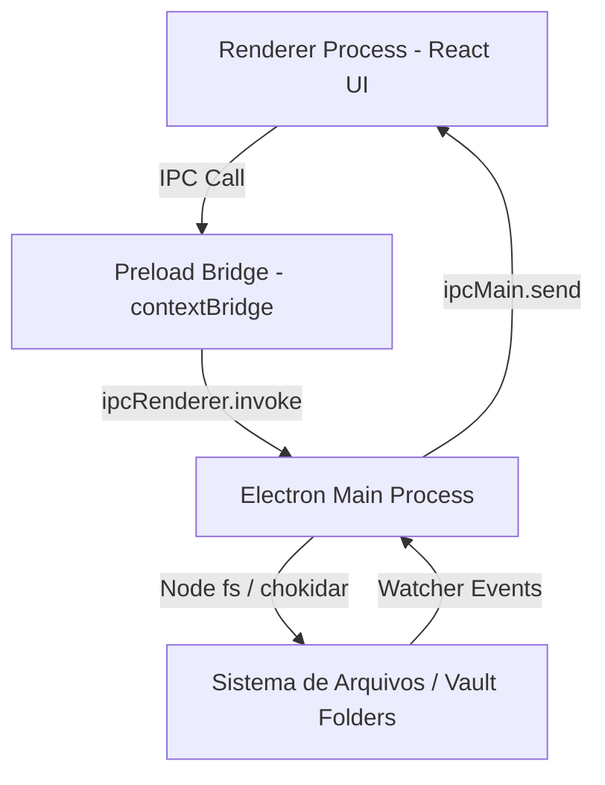

# Design Spec: Vault Notes (Desktop App)

**Data**: 2026-07-28  
**Status**: Aprovado  
**Paper Design Reference**: `Vault Notes UI` (Paper design URL: `https.app.paper.design/file/01KYAMNMYE8TWK88E7QQ9S5G72/1-0`)

---

## 1. Visão Geral do Produto

**VAULT NOTES** é um aplicativo desktop moderno de bloco de notas construído com **Electron + React + TypeScript** (`electron-vite`). Ele funciona no conceito de **Vaults** (pastas no sistema de arquivos local do usuário), permitindo organizar, criar e editar notas em formato **Markdown (`.md`)** e **Texto Puro (`.txt`)**, além de exportação para `.txt`.

O design segue uma estética elegante Cyberpunk / Dark Neon extraída diretamente do Paper UI com paleta neon em tons de Rosa Neon (`#FF007F`), Ciano Neon (`#00E5FF`), fundo escuro profundo (`#060714` / `#070919`) e bordas tecnologicamente acentuadas (`#141C3B`).

---

## 2. Requisitos Principais & Casos de Uso

1. **Onboarding & Gerenciamento de Vaults**:
   - Na primeira execução, o app solicita que o usuário selecione uma pasta no computador como seu **Vault Padrão**.
   - O indicador e seletor do Vault ativo fica situado no **canto inferior esquerdo da barra lateral**, logo abaixo da lista de notas.
   - O usuário pode cadastrar novos vaults (outras pastas) e alternar entre eles a qualquer momento.

2. **Leitura e Escrita de Notas**:
   - Salvamento automático padrão em arquivos `.md` (Markdown).
   - Suporte a leitura e edição nativa de arquivos `.txt`.
   - Recurso de **Exportar para .txt**.
   - Auto-salvamento em disco transparente (debounce de 500ms).

3. **Editor Rico & Formatação**:
   - Construído sobre **TipTap (ProseMirror)**.
   - Recursos da Barra de Ferramentas:
     - Alternar visão da sidebar
     - Excluir / Mover para lixeira
     - Duplicar nota / Exportar
     - Nova Nota (`+`)
     - Lista de Tarefas / Checkbox (`☑`)
     - Troca de Família de Fonte (`Aa` - Inter, Warriot Tech, Monospace, Sans-serif)
     - Troca de Cor da Fonte (`Pen/Dropper` - seletores e paletas neon)
     - Negrito (**B**), Itálico (*I*), Sublinhado (_U_)
     - Alinhamento de Texto (Esquerda, Centro, Direita, Justificado)

---

## 3. Arquitetura de Software & Fluxo IPC



### Contrato de IPC (Main ↔ Preload ↔ Renderer)

- `vault:select-folder`: Abre diálogo nativo do sistema operacional (`dialog.showOpenDialog`) para selecionar pasta do Vault.
- `vault:get-active-vault`: Retorna a pasta do vault atual e a lista de vaults salvos no `electron-store`.
- `vault:set-active-vault`: Altera o vault ativo.
- `vault:list-notes`: Lê todos os arquivos `.md` e `.txt` da pasta ativa com metadados (título, data de modificação, preview de conteúdo, favoritos).
- `vault:read-note`: Lê o conteúdo UTF-8 da nota.
- `vault:save-note`: Grava alterações na nota em disco (`.md` ou `.txt`).
- `vault:create-note`: Cria uma nova nota no vault.
- `vault:delete-note`: Apaga a nota selecionada.
- `vault:export-txt`: Gera uma cópia exportada em `.txt`.
- `vault:watch-changes`: Monitoramento de alterações externas na pasta via `chokidar`.

---

## 4. Design System & Tokens Estéticos (Extraídos do Paper)

- **Fundo do App**: `#060714`
- **Fundo dos Painéis/Cards**: `#070919`
- **Fundo dos Botões de Ação**: `#090C20`
- **Borda Padrão**: `#141C3B`
- **Rosa Neon (Accent Primary)**: `#FF007F`
- **Ciano Neon (Accent Secondary)**: `#00E5FF`
- **Texto Mudo / Secondary**: `#6B7A99`
- **Divisor / Separador**: `#1E295D`
- **Tipografia Header**: `Warriot Tech`
- **Tipografia UI/Body**: `Inter`

---

## 5. Estrutura de Componentes React

```
src/renderer/src/
├── assets/             # SVGs, ícones e fontes (Warriot Tech, Inter)
├── components/
│   ├── layout/
│   │   ├── Titlebar.tsx         # Barra de título customizada com controles de janela
│   │   └── MainLayout.tsx       # Grid com Sidebar e EditorPanel
│   ├── sidebar/
│   │   ├── Sidebar.tsx          # Painel esquerdo (320px)
│   │   ├── SearchBar.tsx        # Input de busca "Buscar notas..."
│   │   ├── NoteList.tsx         # Lista com ordenação e scrollbar customizado
│   │   ├── NoteCard.tsx         # Card de nota (ativo com glow rosa/ciano, data, preview, favorito)
│   │   └── VaultSelector.tsx    # Canto inferior esquerdo: exibição e troca de vault
│   ├── editor/
│   │   ├── EditorPanel.tsx      # Container do editor (872px)
│   │   ├── EditorToolbar.tsx    # Toolbar com 11 botões de ação e formatação
│   │   ├── TipTapEditor.tsx     # Editor TipTap estilizado
│   │   └── EditorFooter.tsx     # Barra de status (PALAVRAS, CARACTERES, STATUS SALVO)
│   └── modals/
│       └── OnboardingModal.tsx  # Dialog para seleção do primeiro Vault
├── hooks/
│   ├── useVault.ts              # Hook de gerenciamento do estado dos vaults
│   └── useNotes.ts              # Hook de manipulação de notas, busca e autosave
├── types/
│   └── index.ts                 # Interfaces TypeScript (Note, VaultConfig, etc.)
└── App.tsx
```

---

## 6. Validação & Verificação

1. **Typecheck & Linting**: Executar `npm run typecheck` e `npm run lint` sem erros.
2. **Build Electron**: Testar inicialização com `npm run dev` e empacotamento com `npm run build`.
3. **Persistência de Dados**: Testar criação, salvamento, renomeação, exclusão e alternância entre pastas de vaults.
